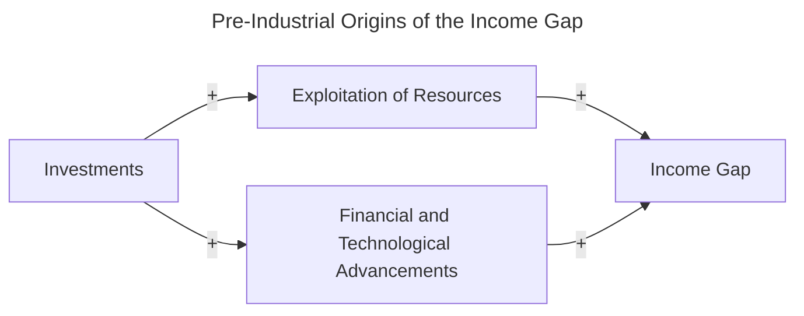
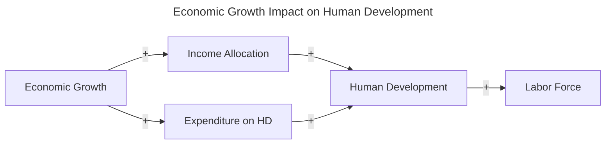

## Paper Summaries

Current Research Q: how has the link between manufacturing employment and economic growth evolved over time and space?

## Paper 1
Szirmai, Adam. “Industrialisation as an Engine of Growth in Developing Countries, 1950–2005.” Structural Change and Economic Dynamics, vol. 23, no. 4, Dec. 2012, pp. 406–420, 
https://doi.org/10.1016/j.strueco.2011.01.005. 

_How I found this paper_: provided by Professor Shifa 

_Big picture question_: How has manufacturing employment contributed to economic growth across different regions, and how has this contribution shifted in recent decades?

_Hypothesis_: While manufacturing has historically driven economic growth in developing countries, there is a growing divergence of manufacturing employment from economic growth, specifically in the face of globalization and the rise of the service sector in many regions.

_Specific question_: How did technological advancements during the Industrial Revolution boost industrial output and economic growth in nations like Britain, while leaving others like Japan and African countries behind? 

_Hypothesis_: How did technological advancements increase the scale of industrial production which in turn impacted economic growth?

_Theory_: With the start of the Industrial Revolution, most European countries embraced new technology, leading to more jobs and increased income. Britain, as the leading nation, saw a rise in per capita revenue, followed by other countries. Japan and many African nations were late to industrialize and are still catching up

## Paper 2

_Citation_: Appiah, Michael, Richard Amoasi, and Doreen Idan Frowne. "Human development and its effects on economic growth and development." International Research Journal of Business Studies 12.2 (2019). 

_Link_: https://scholar.google.com/scholar?hl=en&as_sdt=0%2C33&q=economic+growth+and+development&oq=
> [!NOTE]
> (The direct link shows an error - so to access the pdf, please click on the link above and go to the third link, which is an academia pdf. )

_How I found this paper_: Detailed search on Google Scholar.

_Big Picture Question_: How does the Human Development Index specifically impact GDP growth in African countries between 1990 and 2015?

_Specific Question_: How have some African countries achieved a very high human development when controlling for inflation, capital, investment, labor, and foreign aid between 1990 and 2015?

_Hypothesis_: As the life expectancy increases in African nations, we can observe a rise in human development through the rise of GDP.

_Theory_: The introduction argues that increased access to education, sanitation, and essential foods leads to higher life expectancy. As living standards improve, productivity at both the family and national levels rises due to income levels. 

## Paper 3

Citation: Maddison A. A Comparison of Levels of GDP Per Capita in Developed and Developing Countries, 1700–1980. The Journal of Economic History. 1983;43(1):27-41. doi:10.1017/S0022050700028965

Link: https://www.cambridge.org/core/journals/journal-of-economic-history/article/comparison-of-levels-of-gdp-per-capita-in-developed-and-developing-countries-17001980/B2EE78543292CA758F00E60E6988E23F

_How I found this paper_: I made a detailed search on Google Scholar.

_Big Picture Question_: How has the per capita income gap between developing and developed countries changed and evolved over time, specifically before the Industrial Revolution happened? 

_Specific Question_: Did Western Europe always possess a significant wealth advantage over developing regions in the 18th century or did this advantage only start during the Industrial Revolution?

_Theory_: The pre-Industrial Revolution wealth of Western Europe is a result of centuries of investment, exploitation of resources, and financial and technological advancements, which led to an economic lead that widened the income gap with developing countries.

_Hypothesis_: Western Europe has always had a significant per capita income lead over developing countries, even before the Industrial Revolution.

## Paper 4

Citation:  Gustav Ranis, et al. “Economic Growth and Human Development.” World Development, Pergamon, 2 Feb. 2000, 

Link: https://www.sciencedirect.com/science/article/pii/S0305750X9900131X

_How I found this paper_: I found this paper by making a detailed search on Google Scholar.

_Big picture question_: How does economic growth relate to human development in policy planning and how does this relationship interconnect them? 

_Specific question_: By understanding the independence between EG and HD through data and empirical evidence how can we address policing priorities between growth and development?

_Hypothesis_: If human development is prioritized, it will lead to an increase in economic growth, which will then contribute to growth and development in the long term.  

_Theory_: There is a strong relationship between economic growth and human development suggesting that they influence and reinforce each other in what can either become a vicious or virtuous cycle.  

    

## Paper 5

Citation: Helleiner, Gerald K. "Direct foreign investment and manufacturing for export in developing countries: a review of the issues." Policies for Development: Essays in Honour of Gamani Corea (1988): 123-153.

Link: https://link.springer.com/chapter/10.1007/978-1-349-09416-5_6

Big Picture Question: What is the role of direct foreign investment in the development of export-oriented manufacturing in developing countries?

Specific Question: How effective is direct foreign investment in promoting stable development finance, structural adjustment, and export-oriented growth, and what policies enhance or hinder its impact?

Theory: Direct foreign investment serves as a crucial source of external finance and expertise for developing countries, especially in manufacturing for export

Hypothesis: As FDI increases, so does political stability, exports, and standards of living.

## Paper 6 

_Citation_: Haraguchi, Nobuya, et al. “The Importance of Manufacturing in Economic Development: Has This Changed?” World Development, vol. 93, May 2017, pp. 293–315, www.sciencedirect.com/science/article/pii/S0305750X16302613, https://doi.org/10.1016/j.worlddev.2016.12.013.
‌
_How I found this paper_: I found this paper by making a detailed search on Google Scholar 

_Big picture question_: How has manufacturing’s  role in economic development and growth, in developing countries, changed over the last 25 years? 

_Specific question_: Has the importance of manufacturing declined in terms of employment, growth, and value-added gone down due to global shifts or concentration in a few populous countries? 

_Theory_: Industrialization still remains a key factor of economic growth and development, but manufacturing has only become concentrated in a few countries, it hasn't diminished overall. 

_Hypothesis_: The decline in manufacturing in developing regions is not due to a reduction in global opportunities, but due to the fact that manufacturing is concentrated in a number of  populous nations. 

