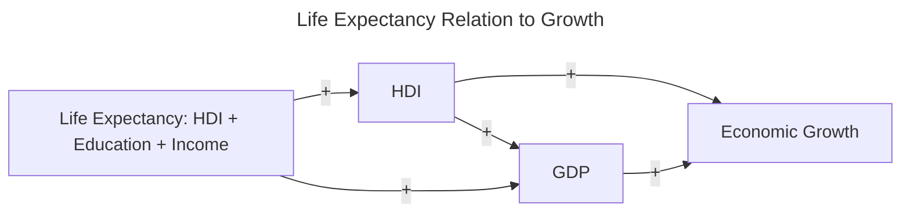

## Paper Summaries

Current Research Q: how has the link between manufacturing employment and economic growth evolved over time and space?

## Paper 1
Szirmai, Adam. “Industrialisation as an Engine of Growth in Developing Countries, 1950–2005.” Structural Change and Economic Dynamics, vol. 23, no. 4, Dec. 2012, pp. 406–420, 
https://doi.org/10.1016/j.strueco.2011.01.005. 

How I found this paper: provided by Professor Shifa 

Big picture question: How has manufacturing employment contributed to economic growth across different regions, and how has this contribution shifted in recent decades?

Hypothesis: While manufacturing has historically driven economic growth in developing countries, there is a growing divergence of manufacturing employment from economic growth, specifically in the face of globalization and the rise of the service sector in many regions.

Specific question: How did technological advancements during the Industrial Revolution boost industrial output and economic growth in nations like Britain, while leaving others like Japan and African countries behind? 

Hypothesis: How did technological advancements increase the scale of industrial production which in turn impacted economic growth?

Theory: With the start of the Industrial Revolution, most European countries embraced new technology, leading to more jobs and increased income. Britain, as the leading nation, saw a rise in per capita revenue, followed by other countries. Japan and many African nations were late to industrialize and are still catching up

## Paper 2

_Citation_: Appiah, Michael, Richard Amoasi, and Doreen Idan Frowne. "Human development and its effects on economic growth and development." International Research Journal of Business Studies 12.2 (2019). 

_Link_: https://scholar.google.com/scholar?hl=en&as_sdt=0%2C33&q=economic+growth+and+development&oq=
> [!NOTE]
> (The direct link shows an error - so to access the pdf, please click on the link above and go to the third link, which is an academia pdf. )

_Big Picture Question_: How does the Human Development Index specifically impact GDP growth in African countries between 1990 and 2015?

_Specific Question_: How have some African countries achieved a very high human development when controlling for inflation, capital, investment, labor, and foreign aid between 1990 and 2015?

_Hypothesis_: As the life expectancy increases in African nations, we can observe a rise in human development through the rise of GDP.

_Theory_: The introduction argues that increased access to education, sanitation, and essential foods leads to higher life expectancy. As living standards improve, productivity at both the family and national levels rises due to income levels. 

## Paper 3

Citation: Maddison A. A Comparison of Levels of GDP Per Capita in Developed and Developing Countries, 1700–1980. The Journal of Economic History. 1983;43(1):27-41. doi:10.1017/S0022050700028965

Link: https://www.cambridge.org/core/journals/journal-of-economic-history/article/comparison-of-levels-of-gdp-per-capita-in-developed-and-developing-countries-17001980/B2EE78543292CA758F00E60E6988E23F

## Paper 4

Citation:  Gustav Ranis, et al. “Economic Growth and Human Development.” World Development, Pergamon, 2 Feb. 2000, 

Link: https://www.sciencedirect.com/science/article/pii/S0305750X9900131X

## Paper 5

Citation:  Schmitz, Hubert. "Growth constraints on small-scale manufacturing in developing countries: a critical review." World development 10.6 (1982): 429-450.

Link: https://www.sciencedirect.com/science/article/pii/0305750X82900018

## Paper 6

Citation: Helleiner, Gerald K. "Direct foreign investment and manufacturing for export in developing countries: a review of the issues." Policies for Development: Essays in Honour of Gamani Corea (1988): 123-153.

Link: https://link.springer.com/chapter/10.1007/978-1-349-09416-5_6

Big Picture Question: What is the role of direct foreign investment in the development of export-oriented manufacturing in developing countries?

Specific Question: How effective is direct foreign investment in promoting stable development finance, structural adjustment, and export-oriented growth, and what policies enhance or hinder its impact?

Theory: Direct foreign investment serves as a crucial source of external finance and expertise for developing countries, especially in manufacturing for export

Hypotheses:
- Relaxing policies and incentivizing FDI will encourage investment flows and improve export performance.
- FDI is more likely to benefit developing countries that have outward-oriented economic policies, stable political climates, and favorable conditions for foreign investors.
- Different forms of investment, such as joint ventures or non-equity partnerships, may be more beneficial than traditional majority-owned FDI, especially in manufacturing for export.

## Paper 7 
https://www.sciencedirect.com/science/article/abs/pii/S0305750X16302613

## Paper 8 
_Citation_: Szirmai, Adam. "Manufacturing and economic development." Pathways to industrialization in the twenty-first century: New challenges and emerging paradigms (2013): 53-75.

_Link_: https://books.google.ca/books?hl=en&lr=&id=XlxDKcxkWBMC&oi=fnd&pg=PA53&dq=development+and+manufacturing+growth&ots=XQ4zu8vlyY&sig=c2I1FWSXf92-rCv_cJe7XDrntjk

_Big Picture question_: What are the impacts of services on the manufacturing market?

_Specific Question_: How does development change in countries that have shifted form agricultural production to more that are service oriented?

_Theory_: While the industrial revolution played a key role in countries' development, the shift now from agricultural (primary sector) to a services market (tertiary sector) the paper tries to explore to what extent manufacturing is affected due to these changes. 

_Hypothesis_: As industrial production (output) increases, employment will potentially increase. 

